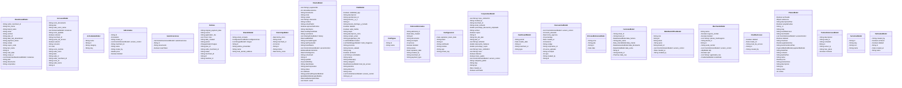

```mermaid
classDiagram
    direction BT
    class AbandonedModel {
        - String seller_merchant_id
        - String first_name
        - String brand_name
        - String email
        - String vertical
        - String plan_id
        - String date_last_abandoned
        - String payment_status
        - String celular
        - String cupon_code
        - String last_name
        - String id
        - String mail_date
        - String corpo_id
        - List~InstanciasAbandonedModel~ instances
        - String plan
        - String documento
        - String corporativo
    }
    class AccesosModel {
        - String socio_documento
        - String plan
        - String sede_socio_name
        - List~InstanciasModel~ instances
        - String socio_apellido
        - boolean entered
        - String merchant_id
        - String punto_de_acceso
        - boolean externo
        - String convenio
        - int costo
        - String socio_nombre
        - String sede_socio
        - String date
        - String sede_id
        - String seller_merchant_id
        - String socio_id
        - String sede_name
        - String id
    }
    class ActividadesModel {
        - String name
        - String id
        - String category
        - String slug
    }
    class Adicionales {
        - String id
        - int duration
        - String create_at
        - List~ControlVersionModel~ version_control
        - String merchant_id
        - String name
        - String create_by
        - double price
        - boolean deleted
    }
    class Autenticaciones {
        - List~AutenticacionesGModel~ autenticaciones
        - String id
        - String documento
        - boolean resetToken
    }
    class Boletas {
        - String original_payment_date
        - String source
        - String application_fee
        - List~Tries~ tries
        - String date_created
        - String period
        - ChargesDetail charges
        - String plan_id
        - String seller_merchant_id
        - String status
        - String merchant_id
        - String id
        - String member_id
    }
    class BrandsModel {
        - String email_contacto
        - ConfiguracionesModel configuraciones
        - List~ImagesModel~ images
        - String id
        - String politica_privacidad
        - String name
        - String mail_sender_address
    }
    class CierreCajaModel {
        - Date fecha_inicio
        - String email
        - String merchant_id
        - int monto
        - String id
        - String motivo
        - Date fecha_cierre
    }
    class ClienteModel {
        - List~String~ paymentIds
        - int cobrosRecurrentes
        - String documento
        - String email
        - String celular
        - List~String~ discounts
        - String nombre
        - String activePlanId
        - boolean aprovechaPuntos
        - String tokenSpice
        - Date nextPaymentDate
        - String nacimiento
        - List~HistoryEntryModel~ history
        - Date lastModified
        - String mercadoPagoId
        - String lastPaymentId
        - String brandName
        - List~ControlVersionModel~ versionControl
        - AddressModel domicilio
        - Date fechaVigencia
        - String activeCard
        - String id
        - String apellido
        - int periodInitDay
        - String tokenStatus
        - String planCorporativo
        - String status
        - int codClient
        - String preferredPaymentMethod
        - AptoMedicoModel aptoMedico
        - Date lastSubscriptionDate
        - List~Card~ cards
    }
    class ClubModel {
        - boolean visibilidad_app
        - String descripcion
        - String sportaccess_id
        - String horario_l_a_v
        - String id
        - String horario_domingo_y_feriado
        - boolean deleted
        - boolean sede_familia
        - String map2
        - String descripcion_corta
        - String contact_email
        - String googlemaps_link
        - LocationModel location
        - List~MultiImagenModel~ multi_imagenes
        - String provincia
        - String horario_sabado
        - String slug
        - boolean archived
        - List~String~ actividades
        - String name
        - String whatssapp
        - String categoria
        - NivelDeAccesoModel nivel_de_acceso
        - String telefono
        - String direccion
        - String zona
        - List~ControlVersionModel~ version_control
        - String qr_url
    }
    class ClubTypes {
        - String id
        - String name
    }
    class CobrosAdicionales {
        - String adicional_id
        - Date date_created
        - String id
        - String documento
        - String concepto
        - int princeo
        - boolean deleted
        - String status
        - Date expiration_date
        - String created_by
        - String merchant_id
        - String payment_type
    }
    class Configuracion {
        - Date expiration_token_data
        - String token
        - String id
        - String certificado
        - String nombre
        - String sign
        - String private_key
    }
    class CorporativoModel {
        - List~String~ hero_1000x700
        - String created_by
        - String merchant_id
        - String email_contacto
        - double porcentaje_descuento_empleado
        - String vertical
        - boolean cupon
        - String id
        - String link_del_plan
        - String plan_id
        - List~String~ whitelist
        - double descuento_haberes
        - double porcentaje_cupon
        - List~String~ hero_1280x523
        - List~String~ hero
        - boolean deleted
        - boolean tiene_padre
        - List~ControlVersionModel~ version_control
        - String campania_padre
        - String slug
        - String tipo
        - Date created_at
        - boolean archivado
    }
    class DashboardModel {
        - String period
        - Date creade_date
        - String id
        - String merchant_id
        - String type
    }
    class DescuentosModel {
        - List~ControlVersionModel~ version_control
        - int monto_absoulto
        - Date fecha_vigencia
        - int porcentaje
        - Date created_at
        - int duracion
        - String codigo
        - String corporativo_id
        - int veces_aplicado
        - String concepto
        - int cupo
        - String created_by
        - String id
    }
    class ErroresMolinetesModel {
        - String error
        - String pda
        - String id
        - Date date
    }
    class FacturasModel {
        ~ String email_id
        ~ String brand_id
        - DataFacturaModel data_factura
        ~ String plan_name
        - Data_clienteModel data_cliente
        - DataFacturanteModel data_facturante
        - DataVentaModel data_venta
        - String id
        ~ String boleta_id
        ~ PlanCae data_cae
    }
    class MailsBackOfficeModel {
        - String role
        - String id
        - String email
        ~ String spice
        - String brand_id
        ~ List~ControlVersionModel~ version_control
        ~ Date created_at
        ~ String created_by
    }
    class MerchantsModel {
        - String name
        ~ boolean negocio_central
        ~ boolean deleted
        ~ List~String~ planes_multinegocio
        ~ String brand_id
        - String id
        ~ String sede_central
        ~ List~ControlVersionModel~ version_control
        ~ AfipModel afip
        ~ boolean split
        ~ List~String~ application_fee
        ~ CredentialsModel credentials
    }
    class NivelDeAcceso {
        ~ boolean deleted
        ~ Date create_At
        ~ String nivel_de_acceso
        ~ String id
        ~ String created_by
    }
    class PlanesModel {
        - Boolean archivado
        - Object sedeLocal
        - String descripcionPlan
        - Boolean aceptaCuotas
        - String _id
        - String slug
        - String nivelDeAcceso
        - String merchantId
        - List~ControlVersionModel~ versionControl
        - Boolean deleted
        - String checkout
        - Double applicationFee
        - String textoCondicionPlan
        - PaymentMethodModel paymentMethods
        - String tituloPlan
        - String contacto
        - String tipoDePlan
        - String name
        - Double price
        - String prestaciones
        - String descripcion
        - String tyc
        - String cobro
        - int cuotas
    }
    class PuntosDeAccesoModel {
        ~ String descripcion
        ~ String sede_id
        ~ String comando
        - String id
        ~ String server_ip
        ~ String mac_placa
        ~ boolean molinete
    }
    class ServiciosModel {
        - String id
        - String slug
        - String icon
        - String name
    }
    class VerticalesModel {
        ~ String created_by
        ~ boolean archived
        ~ boolean deleted
        - String id
        ~ Date created_at
        - String name
    }


```
